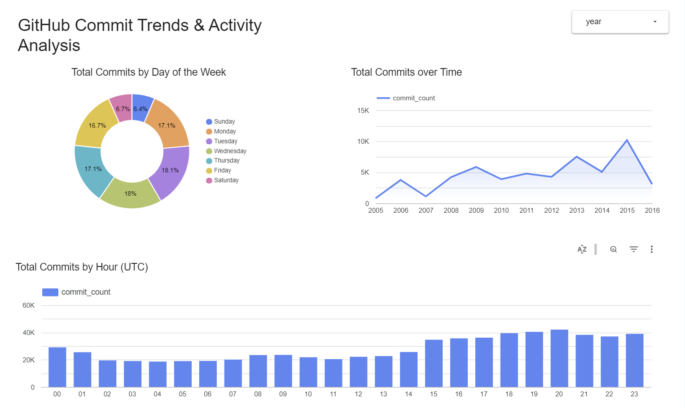
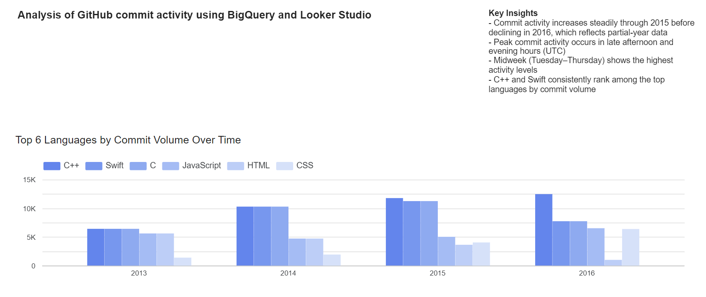

# GitHub Commit Trends Analysis
Analysis of GitHub commit activity using BigQuery and Looker Studio

## Overview
This project analyzes GitHub commit activity using a public dataset available in Google BigQuery. Due to the size of the full dataset, a sampled version of the table was used for analysis.

The goal is to identify trends in commit activity over time, by programming language, and across different time dimensions.

## Tools Used
- Google BigQuery
- SQL
- Looker Studio

## Key Insights
- Commit activity increases steadily through 2015 before declining in 2016, as only partial-year data is available  
- Peak commit activity occurs in late afternoon and evening hours (UTC)  
- Midweek (Tuesday–Thursday) shows the highest levels of activity 
- C++ and Swift consistently rank among the top languages by commit volume  

## Dashboard Preview
Key visualizations from the analysis:

## PDF Version
A PDF version of the dashboard is available here:  
[View PDF](docs/commit_trends_dashboard.pdf)

## SQL Queries
The queries used for this analysis can be found in the `/sql` folder.

## Data Source
The dataset used is a public GitHub dataset available in Google BigQuery. A sampled subset was used to support efficient querying and visualization.

## Project Structure
/sql       → SQL queries used for analysis  
/images    → Dashboard screenshots  
/docs      → PDF export of dashboard  
